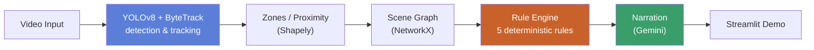

<div align="center">

# ChainSight

*A warehouse safety reasoning pipeline for a single fixed camera, run offline over recorded video.*

[](#requirements)
[](#project-structure)
[](#quickstart--browse-a-finished-run)
[](#project-structure)
[](#testing)
[](https://github.com/Narendran-ds/chainsight)

</div>

---

It detects people/equipment (YOLOv8), tracks them across frames (ByteTrack), reasons about
zones and proximity (Shapely), builds a scene graph of the clip (NetworkX), evaluates five
deterministic safety rules against that graph, and turns whatever fired into plain-English
narration (Gemini) — all browsable afterward in a Streamlit demo.

> **Only the detector is a trained model.** Every stage after YOLOv8 — tracking, spatial
> reasoning, the scene graph, and the rule engine — is deterministic, non-learned Python.
> That's a deliberate choice: it keeps every rule decision traceable back to explicit code,
> not a second model's judgment.

📖 **Docs:** [`architecture.md`](docs/architecture.md) for a fuller pipeline walkthrough ·
[`scope_and_limitations.md`](docs/scope_and_limitations.md) for reasoning and known limitations ·
[`demo_scenarios.md`](docs/demo_scenarios.md) for what each demo clip shows and why ·
[`progress.md`](docs/progress.md) for what's built vs. still open.

<p align="center">
  <a href="#quickstart--browse-a-finished-run"><b>Quickstart</b></a> ·
  <a href="#running-the-pipeline-yourself"><b>Run the Pipeline</b></a> ·
  <a href="#the-five-rules"><b>The Five Rules</b></a> ·
  <a href="#project-structure"><b>Structure</b></a> ·
  <a href="#testing"><b>Testing</b></a>
</p>

---

## Architecture

```
YOLOv8 + ByteTrack -> zones/proximity -> scene graph -> rule engine -> narration -> demo
     tracks.json      spatial_events.json   world_graph.json   rule_events.json   narration.json
```



## Quickstart — Browse a Finished Run

The repo ships with pre-computed outputs for two sample clips (a forklift/pedestrian
near-miss and a blocked exit), plus the trained detector weights, so the demo works with no
GPU and no setup beyond installing dependencies:

```bash
pip install -r requirements.txt
streamlit run demo/app.py
```

Pick `nearmiss` or `blocked_exit` from the sidebar. You'll see the fired rule events, a
frame-by-frame scrubber (with "jump to frame" / "jump to time (s)" inputs alongside it, all
three kept in sync) with bounding boxes and zone overlays drawn live, and (for `nearmiss`)
Gemini narration. `outputs/` and `models/finetuned/run2_exit_marker/` are committed to the
repo for exactly this reason — clone and run, nothing to download first.

## Running the Pipeline Yourself

### On the Included Sample Clips

```bash
python scripts/run_pipeline.py \
  --model models/finetuned/run2_exit_marker/weights/best.pt \
  --video data/staged_clips/videos/forklift_pedestrian_nearmiss.mp4 \
  --zones configs/zones_forklift_pedestrian_nearmiss.json \
  --run-name nearmiss
```

This re-runs detection+tracking (the slow, GPU-bound stage) through to the rule engine,
writing `outputs/{tracks,spatial_events,world_graph_summary,rule_events,manifest}_nearmiss.json`.
Add `--narrate` to also generate narration via Gemini (requires `GEMINI_API_KEY` — copy
`.env.example` to `.env` and fill it in). Re-run `streamlit run demo/app.py` afterward to see
your run appear in the sidebar.

### On Your Own Video

1. **Define zones** — click out restricted/exit polygons on a representative frame:
   ```bash
   python scripts/define_zones.py --video <clip.mp4> --frame 0 --out configs/zones.json
   ```
2. **Run the pipeline** as above, pointing `--video`/`--zones` at your files. If you don't
   have your own trained weights, `models/finetuned/run2_exit_marker/weights/best.pt` is a
   general warehouse-scene detector (17 classes — see `data/class_mapping.yaml`) and a
   reasonable starting point.
3. **Browse it** in the demo.

Each stage is also runnable on its own (useful for iterating on one stage without re-running
the tracker) — see the "Reasoning pipeline" section in [`CLAUDE.md`](CLAUDE.md) for the
individual `scripts/run_*.py` commands.

<details>
<summary><b>Training a new detector</b></summary>

```bash
python scripts/prepare_data.py            # merge source datasets -> data/processed/
python scripts/split_three_way.py          # leakage-safe train/val/test split
python scripts/verify_no_leakage.py        # confirm zero overlap across splits
python src/vision/train.py --run-name <name>
```

See `CLAUDE.md`'s "Commands" section for flags and details (dry-run mode, resuming, W&B
logging).

</details>

<details>
<summary><b>Validation runs beyond the two primary demo clips</b></summary>

`nearmiss` and `blocked_exit` are the two clips the demo is tuned around, but the pipeline
has also been run end-to-end on two additional clips (`aisle_test`, `outdoor_exit_test`)
purely to stress-test it against footage it wasn't designed for — both are browsable in the
demo too. Both surfaced genuine limitations rather than confirming a clean result: a panning
(non-fixed) camera invalidates zone-based reasoning regardless of thresholds, a forklift's
own driver can be detected as a separate `person` and spuriously fire the near-miss/intrusion
rules, and the 17-class detector has no "barrier"/"cone" class, so an obstruction gets
misclassified even when the rule that depends on it still fires correctly. All three are
written up in `docs/scope_and_limitations.md` §5 and §7 — worth reading before pointing this
pipeline at new footage.

</details>

## The Five Rules

| Rule | Fires when |
|---|---|
| **R1** — Restricted Zone Intrusion | a person enters a `restricted`-type zone |
| **R2** — Forklift-Pedestrian Near-Miss | a person and forklift stay within a resolution-normalized proximity threshold, inside a restricted zone, for N consecutive frames |
| **R3** — PPE Violation | a `no_vest`/`no_helmet` detection overlaps a person's bounding box |
| **R4** — Exit Blockage | a non-person object occupies an `exit`-type zone continuously past a duration threshold |
| **R5** — Loitering in Restricted Zone | a person stays inside a restricted zone past a duration threshold |

Every fired rule produces a structured event (trigger / evidence / conclusion), never a bare
boolean — narration only rephrases these, it never adds a new judgment.

## Project Structure

```
src/
  vision/       YOLOv8 detection + ByteTrack tracking, training
  spatial/      zone containment + proximity (Shapely)
  world_graph/  per-frame and summary scene graphs (NetworkX)
  rules/        the 5 deterministic safety rules
  narration/    Gemini-based plain-English narration
  pipeline.py   single-entry orchestrator chaining all of the above
scripts/        one CLI per stage, plus data-prep/training tooling
demo/           Streamlit app — browses precomputed runs from outputs/
configs/        zone definitions, class mappings
docs/           architecture, scope/limitations, demo scenarios, progress tracker
tests/          pytest regression suite (58 tests)
```

## Testing

```bash
pytest
```

## Requirements

Python 3.9+. GPU (CUDA) recommended for the tracker/training stages but not required for
everything downstream of `tracks.json`, including the demo.

---

<div align="center">
<sub>Built by <a href="https://github.com/Narendran-ds">Narendran L</a></sub>
</div>
